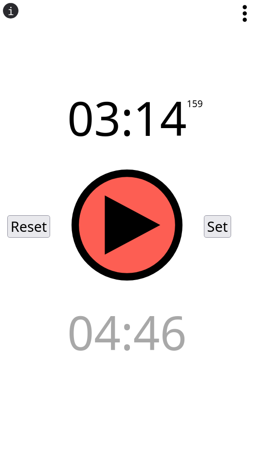

# rcj-rescue-clock

This is a Progressive Web App to measure the time at RoboCup Junior (Rescue).
It's available on [nikolockenvitz.github.io/rcj-rescue-clock](https://nikolockenvitz.github.io/rcj-rescue-clock).
You can also get there by scanning the QR code below.

  

You can start and stop the time and see the past and remaining time.
It will also play an alert if the time is over.

Since it's a PWA, you can "install" it and add it to your home screen (runs offline).

  

